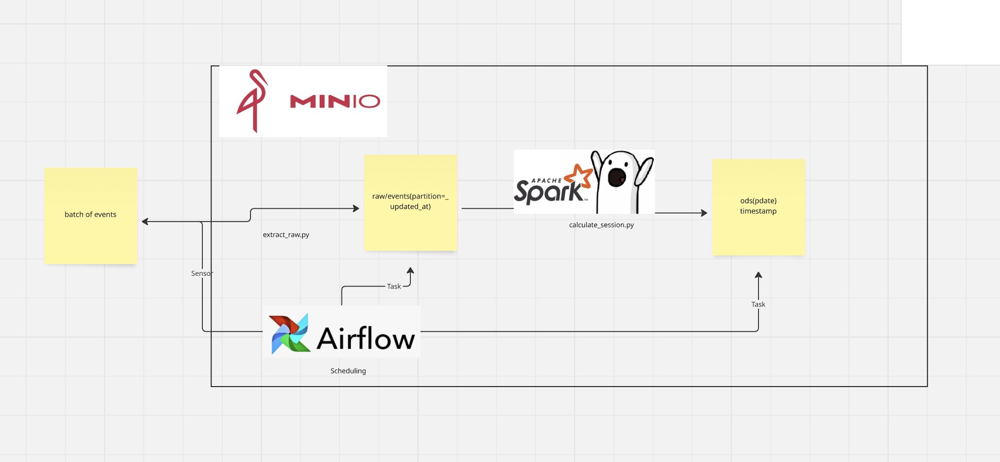

# Data Processing Pipeline for User Sessions

## Overview
This project processes raw event data to detect user sessions, handle deduplication, flag user actions, calculate time differences, and organize the data by session and date. The raw data is stored in a **raw layer**, partitioned by the data arrival date, and then processed into a **cleaned ODS (Operational Data Store) layer** for further analysis and reporting.

## Problem Overview
We receive a batch of event data every day with a 5-day business date update depth. Since we don't know much about the source of this data, we assume the worst-case scenario. The data doesn’t have a technical timestamp for when it enters our system, so we’ve decided to create a raw layer—a table where the incoming data is stored, partitioned by the data arrival date (`_updated_at`). This layer is crucial for safety and data retention, given that we don't know the source's reliability or the duration for which data is stored.

### Raw Layer (Security & Retention):
- **Partitioning**: The raw layer is partitioned by the arrival date to help with ETL processing.
- **Retention**: A retention period of 2 weeks is set for this layer, to allow for reprocessing and adjustments in case of errors in calculations or changes in business logic.

### Next Step - ODS Layer (Cleaned Data):
After the raw layer, we process the data into a cleaned layer (ODS) where sessions are assigned. A Python script using Spark and Delta Lake is written for this purpose.

## Why Spark and Delta Lake?

- **Spark**: Chosen for its powerful distributed computing capabilities, making it ideal for fast log processing and aggregation.
- **Delta**: Chosen over Iceberg because it’s simpler in structure and its features (like versioning, metadata, and schema evolution) are sufficient for the task. Delta is preferred because of less frequent updates (once per day), while Iceberg’s merge-on-read feature is more beneficial in high-write environments.

## Project Structure

docker-compose.yml launches MinIO and Spark (master and worker).

Spark can be run in cluster mode if needed. However, everything was done locally.

requirements.txt is provided for local execution.

calculate_session.py contains the main business logic for updating sessions.

extract_raw.py uploads data to the raw layer(ephemeral process without code).

jars/ contains JAR files for Spark.

batches/ stores data batches named according to their ingestion dates.

## Steps in SessionBuilder(The main business logic of updating sessions is contained in file calculate_session.py):

### 1. **Dropping Duplicates**
Any duplicate records with the same combination of `user_id`, `event_id`, `product_code`, and `timestamp` are removed to ensure only unique events are retained.

### 2. **Flagging User Actions**
A new column (`is_user_action`) is added, marking an event as a user action if the `event_id` is one of `['a', 'b', 'c']`.

### 3. **Calculating Time Difference**
The time difference (`time_diff`) is calculated between consecutive events for the same user and product, helping to track the time passed between two events.

### 4. **Identifying New Sessions**
A new session is identified if:
- The time between two events exceeds the session timeout threshold, or
- This is the first event for a user (i.e., there is no previous event to compare the time difference).

### 5. **Session Grouping**
Consecutive events are grouped into a session by summing the `is_new_session` flags, which mark the start of new sessions.

### 6. **Session Start Time**
The start time of each session is determined by identifying the first event that marks the session’s beginning.

### 7. **Session ID Creation**
A unique session ID is created by combining `user_id`, `product_code`, and the session start time.

### 8. **Processing Date**
A `pdate` column is added, which stores only the date part of the `timestamp`. This column is useful for organizing and partitioning the data by date.

To update sessions for existing events, we retrieve users and product codes from the batch  
and match them with data from the past five days.  
Additionally, we include user events from six days ago to ensure sessions are correctly assigned  
for the following day.

## Summary
This process transforms raw event data to detect user sessions and organizes the data for further analysis and reporting.
It was decided to keep empty sessions. Events with empty sessions are also important for the business, as native (non-user) events can reveal errors and bugs in the system. Initially, there was a plan to store them in a separate table and use them in incremental calculations. If an event is assigned a session, it would be removed from the empty sessions table using merge logic. However, this creates a problem with synchronizing updates between two tables. If one table updates and the other does not for some reason, the data in both tables will no longer reflect reality.

Storing everything in one table would make structural analysis easier, but could lead to some problems: Depending on the data specifics, there could be a significant imbalance with zero sessions, which might cause issues during calculations, like skew (this can be fixed by filtering out the data). If there are a lot of data with zero sessions, partitioning by flag (whether there is a session or not) can also be done, which will improve performance when filtering.

